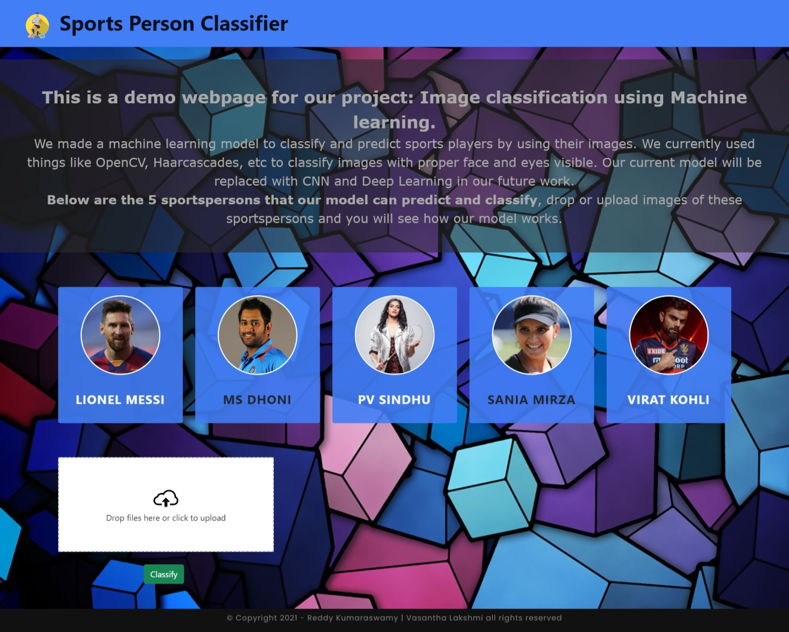

# Sportsperson_classifier
A Machine learning model to detect the face of the sportsperson using OpenCV and Haarcascades.

# Build With
<ul>
  <li><a href="https://www.python.org/">Python</a> - High Level Programming Language</li>
  <li><a href="https://docs.python.org/3/library/">Python Libraries</a> - Numpy, Pandas, Seaborn</li>
  <li><a href="https://jupyter.org/">Jupyter Notebook</a> - Web-based interactive computing platform</li>
  <li><a href="https://www.geeksforgeeks.org/machine-learning/">Machine Learning</a> - Scikit Learn, OpenCV</li>
  <li><a href="https://opencv.org/">OpenCV</a> - Open Source Computer Vision Library</li>
  <li><a href="https://www.geeksforgeeks.org/python-haar-cascades-for-object-detection/">Haar Casscades</a> - A Face Detection Technique</li>
  <li><a href="https://flask.palletsprojects.com/en/2.1.x/">Flask Server</a> - Web Framework</li>
  <li><a href="https://www.w3schools.com/javascript/">JavaScript</a> - The iconic SVG, font, and CSS toolkit</li>
  <li><a href="https://www.w3schools.com/html/">HTML</a> - Structure of Web Page</li>
  <li><a href="https://www.w3schools.com/css/">CSS</a> - Styling of Web Page</li>
  <li><a href="https://fonts.google.com/">Google Fonts</a> - Library of libre licensed fonts</li>
  <li><a href="https://www.heroku.com/">Heroku</a> - Cloud Application Platform</li>
</ul>

# Author
<a href="https://github.com/reddykumaraswamy">Reddy Kumaraswamy</a> (author)
<a href="https://github.com/Vasantha2501">Vasantha Lakshmi</a> (author)

# Website Look - Image

# ToDo
<ol>
  <li>Increase the model accuracy</li>
  <li>Deep Learning and CNN models</li>
</ol>

# Copyright & License
 &copy;Reddy Kumaraswamy & Vasantha Lakshmi 2021 All Rights Reserved.
